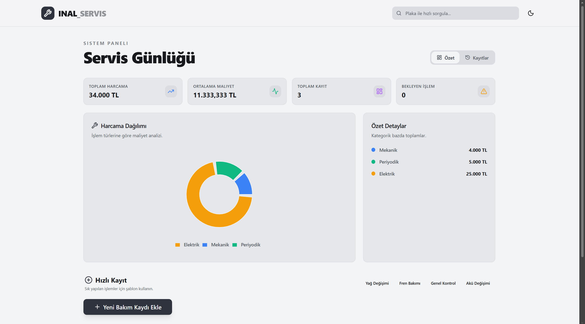
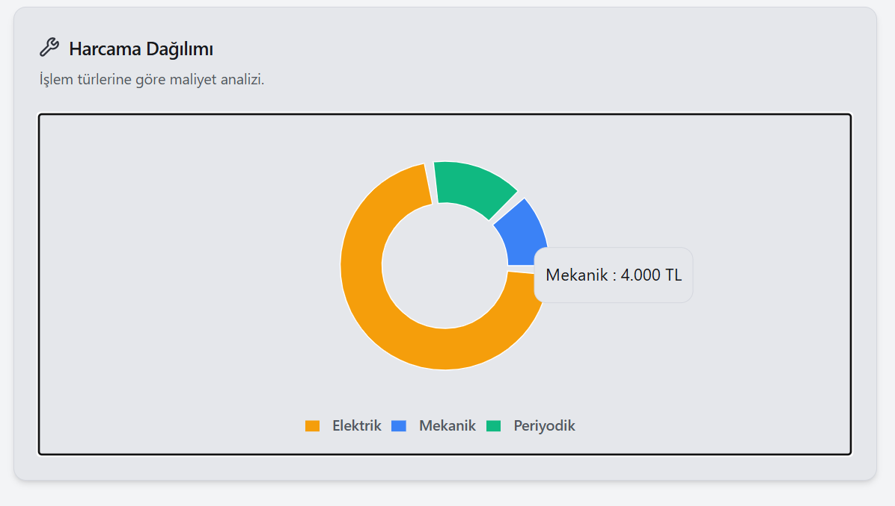
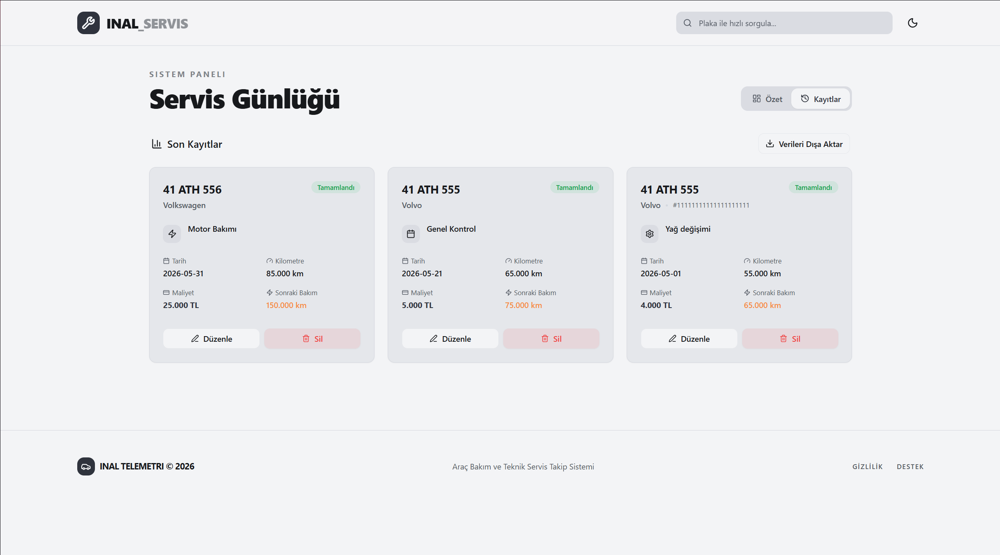
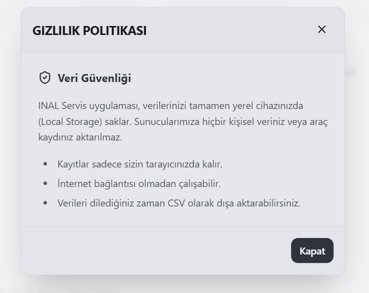

# INAL SERVİS | Araç Bakım ve Teknik Servis Takip Sistemi

Bu proje, Web Geliştirme; Javascript Proje Bilgisi eğitim programı çerçevesinde, modern web teknolojileri kullanılarak geliştirilmiş bir araç bakım yönetim uygulamasıdır. Proje, araç sahiplerinin periyodik bakımlarını, onarımlarını ve servis geçmişlerini profesyonel bir arayüz ile takip etmelerini sağlar.

🚀 **Canlı Demo:** [Projeyi İncelemek İçin Tıklayın]([https://senin-sitenin-linki.netlify.app](https://inal-servis.netlify.app))

## 🚀 Proje Hakkında

Uygulama, **ReactJS** kütüphanesi ve **Tailwind CSS** çerçevesi kullanılarak inşa edilmiştir. Kullanıcı deneyimini ön plana çıkaran premium bir "SaaS Dashboard" estetiğine sahiptir. Veriler tarayıcının yerel depolama alanında (**Local Storage**) güvenli bir şekilde saklanır.

### 🛠 Kullanılan Teknolojiler

- **Kütüphane:** ReactJS (Hooks, Functional Components)
- **Stil Yönetimi:** Tailwind CSS (Modern & Responsive Design)
- **Animasyon:** Framer Motion (Premium micro-interactions)
- **İkonlar:** Lucide React
- **Grafikler:** Recharts
- **Dağıtım:** Netlify/Vercel (Prodüksiyona hazır yapı)

## 📁 Proje Klasör Yapısı

Yönergeye uygun olarak proje aşağıdaki mimari üzerine kurulmuştur:

```
src/
├── Components/    # Reusable UI bileşenleri (Formlar, Kartlar, UI Kit)
├── Pages/         # Ana sayfa ve düzen yapıları
├── Interfaces/    # Veri modelleri ve tip tanımlamaları
└── utils/         # Yardımcı fonksiyonlar
```

## ✨ Temel Özellikler (CRUD)

Proje kapsamında aşağıdaki dört temel işlem (CRUD) başarıyla uygulanmıştır:

1.  **Ekle (Create):** "Hızlı Kayıt" veya detaylı form üzerinden yeni araç servis kaydı ekleme.
2.  **Listele (Read):** Mevcut tüm kayıtların dinamik tablolar ve kartlar şeklinde listelenmesi, plaka sorgulama.
3.  **Güncelle (Update):** Mevcut bir servis kaydının bilgilerini anında düzenleme.
4.  **Sil (Delete):** Hatalı veya eski kayıtların sistemden kaldırılması.

## 📸 Proje Ekran Görüntüleri

Uygulamanın arayüzüne dair görseller aşağıda sunulmuştur:

### 1. Dashboard (Genel Özet)

*Sistem istatistikleri ve harcama dağılım analizi.*

### 2. Harcama Analizi

*İşlem türlerine göre maliyet dağılımı.*

### 3. Kayıt Geçmişi

*Tüm servis işlemlerinin detaylı listesi.*

### 4. Gizlilik ve Veri Yönetimi

*Yerel veri saklama ve güvenlik bilgilendirmesi.*

## 📈 Proje Çıktıları ve Kazanımlar

- **HTML & CSS Temelleri:** Semantik HTML yapısı ve Tailwind CSS ile modern, esnek tasarım uygulamaları geliştirildi.
- **Javascript & React:** State yönetimi, Effect hook'ları ve modüler bileşen mantığı pekiştirildi.
- **Veri Yönetimi:** LocalStorage üzerinden veri kalıcılığı sağlandı ve JSON operasyonları uygulandı.
- **GitHub Deneyimi:** Proje dosyaları GitHub üzerinde public bir depoda yönetilerek versiyon kontrol deneyimi kazanıldı.

---

### 👤 Geliştirici
**Berat İnal**
- [LinkedIn](https://www.linkedin.com/in/berat-inal-2b6bb2218)
- [Email](mailto:brtinal0@gmail.com)

*Bu proje eğitim amaçlı geliştirilmiş olup, tüm telif hakları korunmaktadır.*
